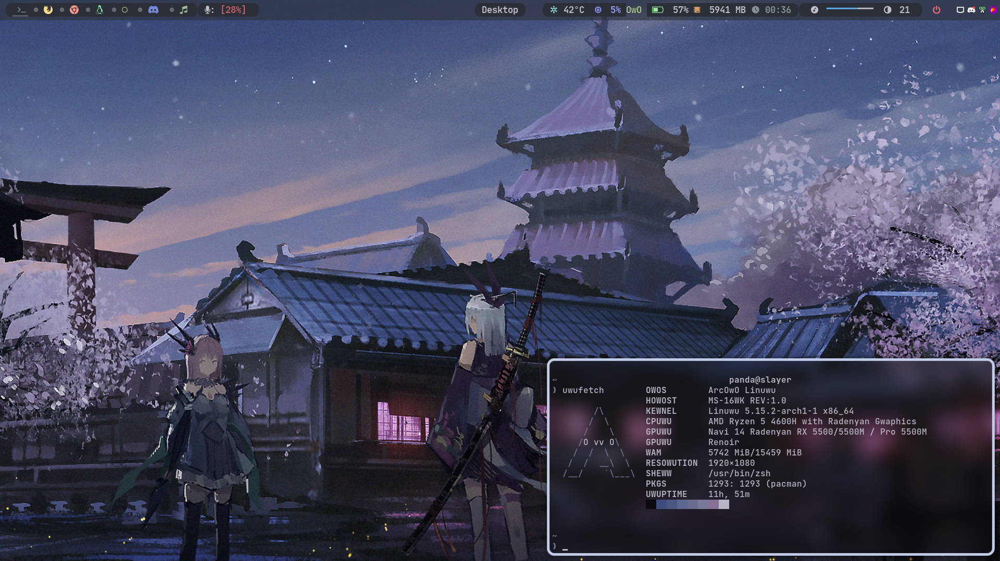
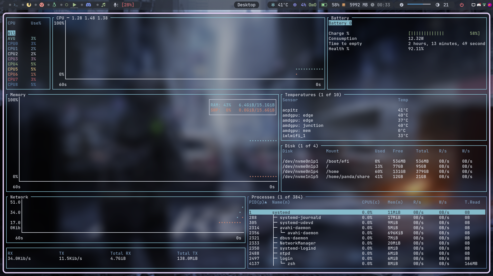
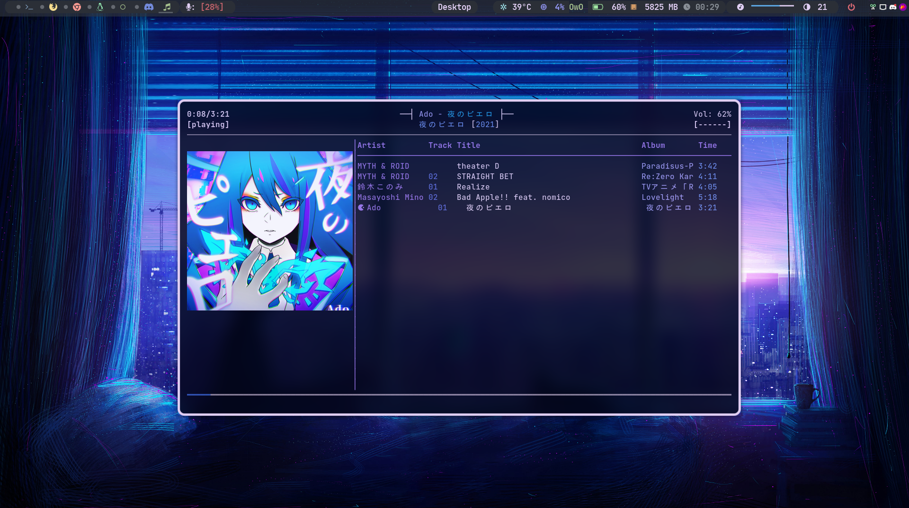

# Welcome to my dotfiles cesspool

### Structure
  - Pictures - Some sample wallpaper and art
  - Scripts  - Some random scripts 
  - .config  - .config folder
  - xorg.config.d - contains X config (Beware some are hardware specific)
  - .bashrc - I don't use it, but it exists for some reason
  - .gitconfig - my global gitconfig
  - .vimrc - My favorite editor's config file
  - .zshrc - The best shell
  - require-bspwm.sh - some required packages to run my config files in bspwm(Outdated)

### INSTALLATION

#### Vim installation
- install vim(ofc)
- clone and install VimPlug (https://github.com/junegunn/vim-plug)
- copy `.vimrc` to `$HOME`
- type `:PlugInstall` in vim cmd

#### shell
- Install oh-my-zsh(https://github.com/ohmyzsh/ohmyzsh)
- copy `.zshrc` to `$HOME`

#### SpaceVim (I use it with nvim)
- Install spacevim
- move `.SpaceVim.d` folder to `$HOME`

# Desktop flex

